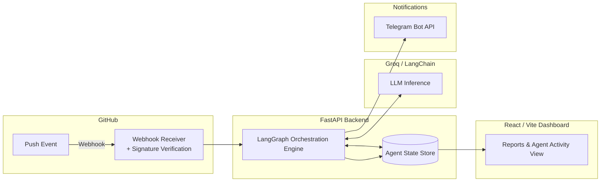
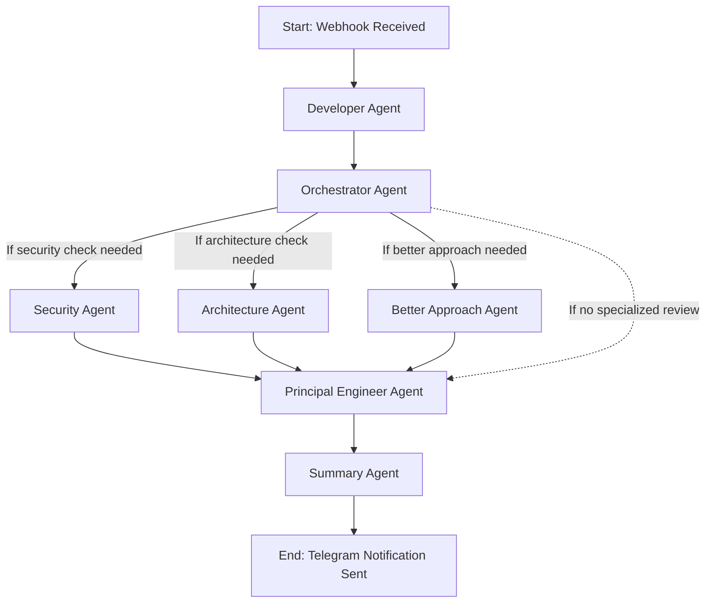

# Git-PR Agent 🚀

**GitAgent** is an AI-powered GitHub assistant that automatically analyzes commit messages and code patches using a multi-agent LLM workflow built on **LangGraph**. It helps developers understand the impact of their commits, surface potential issues (security risks, architectural flaws, better alternative approaches), and improve overall code quality — delivering actionable insights straight to Telegram in real time.

---

## Table of Contents

- [Features](#features-)
- [Architecture Overview](#architecture-overview-)
- [Agent Workflow](#agent-workflow-)
- [Tech Stack](#tech-stack-)
- [Project Structure](#project-structure-)
- [Prerequisites](#prerequisites-)
- [Environment Variables](#environment-variables-)
- [Getting Started](#getting-started-)
  - [Using Docker (Recommended)](#using-docker-recommended)
  - [Running Locally (Without Docker)](#running-locally-without-docker)
- [GitHub Webhook Setup](#github-webhook-setup-)
- [Troubleshooting](#troubleshooting-)
- [Contributing](#contributing-)

---

## Features ✨

- **Multi-Agent Commit Analysis**: Analyzes commits using specialized LLM agents (Developer, Orchestrator, Security, Architecture, Better Approach, Principal Engineer, Summary).
- **Detailed Reports**: Generates comprehensive reports on commit impact, potential bugs, and code improvement suggestions.
- **Telegram Integration**: Instantly sends formatted commit analysis summaries directly to your Telegram chat.
- **Secure Webhooks**: Safely processes GitHub webhook events with HMAC payload signature verification.
- **Conditional Routing**: The orchestrator dynamically decides which specialized agents are required, avoiding unnecessary LLM calls and reducing latency/cost.
- **Docker Support**: Fully containerized for consistent local development and production deployments using Docker and Docker Compose.
- **Frontend Dashboard**: A Vite/React interface for visualizing and managing agent activity and reports.

---

## Architecture Overview 🏗️



The backend exposes a webhook endpoint that GitHub calls on every push. After verifying the payload signature, the event is handed off to a LangGraph state machine, which coordinates a series of LLM-backed agents (via Groq) before sending a consolidated report to Telegram and persisting results for the dashboard.

---

## Agent Workflow 🤖

GitAgent leverages [LangGraph](https://github.com/langchain-ai/langgraph) to orchestrate a team of specialized AI agents. Every time a commit is pushed, it flows through this graph:



| Step | Agent | Responsibility |
|------|-------|-----------------|
| 1 | **Developer Agent** | Performs an initial standard review of the commit message and code diff/patch. |
| 2 | **Orchestrator Agent** | Acts as an Engineering Manager — analyzes the commit and decides which specialized reviews (if any) are required. |
| 3 | **Security Agent** *(conditional)* | Reviews the patch for security vulnerabilities, secrets exposure, and unsafe patterns. |
| 3 | **Architecture Agent** *(conditional)* | Reviews the patch for architectural concerns, design pattern violations, and scalability issues. |
| 3 | **Better Approach Agent** *(conditional)* | Suggests alternative, more idiomatic, or more efficient implementations. |
| 4 | **Principal Engineer Agent** | Consolidates findings from the Developer Agent and any activated specialized agents into a unified review. |
| 5 | **Summary Agent** | Produces the final, easy-to-read summary report and dispatches the Telegram notification. |

Conditional branches ensure specialized agents only run when the Orchestrator determines they're relevant — this keeps response times and LLM costs predictable for routine commits.

---

## Tech Stack 🛠️

- **Backend / Core**: [Python 3.11](https://www.python.org/), [FastAPI](https://fastapi.tiangolo.com/), [Uvicorn](https://www.uvicorn.org/)
- **AI / LLM Orchestration**: [LangGraph](https://github.com/langchain-ai/langgraph), [LangChain Groq](https://groq.com/)
- **Frontend**: Node.js, Vite, React (for data visualization & management)
- **Deployment & Infra**: [Docker](https://www.docker.com/), [Docker Compose](https://docs.docker.com/compose/)
- **Integrations**: Telegram Bot API, GitHub Webhooks

---

## Project Structure 📁

```
.
├── backend/
│   ├── app/
│   │   ├── main.py            # FastAPI entrypoint
│   │   ├── api/                # Routes (webhook, health, etc.)
│   │   ├── agents/              # LangGraph agent definitions & graph wiring
│   │   ├── services/            # Telegram, GitHub, LLM client wrappers
│   │   ├── core/                 # Config, security, signature verification
│   │   └── models/                # Pydantic schemas / data models
│   ├── requirements.txt
│   ├── Dockerfile
│   └── .env.example
├── frontend/
│   ├── src/
│   ├── package.json
│   └── Dockerfile
├── docker-compose.yml
└── README.md
```

> Adjust paths above to match your actual repository layout — this is a recommended structure for production maintainability.

---

## Prerequisites 📝

- [Docker](https://www.docker.com/get-started) and Docker Compose (v2+)
- A [Groq API Key](https://console.groq.com/) for LLM inference
- A Telegram Bot Token & Chat ID ([create one via @BotFather](https://core.telegram.org/bots#how-do-i-create-a-bot))
- GitHub repository admin access (to configure webhooks)
- (Production) A publicly reachable HTTPS endpoint — e.g. via a reverse proxy, load balancer, or tunnel (Cloudflare Tunnel, ngrok for testing, etc.)

---

## Environment Variables 🔐

Create a `.env` file inside `backend/` based on the example below. **Never commit this file to version control.**

| Variable | Required | Description |
|----------|----------|-------------|
| `GROQ_API_KEY` | ✅ | API key used for LLM calls via LangChain Groq. |
| `TELEGRAM_BOT_TOKEN` | ✅ | Token for your Telegram bot, used to send notifications. |
| `TELEGRAM_CHAT_ID` | ✅ | Chat/channel ID where commit summaries are posted. |
| `GITHUB_WEBHOOK_SECRET` | ✅ | Shared secret used to verify GitHub webhook payload signatures (HMAC-SHA256). |
| `LOG_LEVEL` | ⬜ | Logging verbosity (`DEBUG`, `INFO`, `WARNING`, `ERROR`). Defaults to `INFO`. |
| `ALLOWED_REPOS` | ⬜ | Comma-separated list of `owner/repo` allowed to trigger analysis (recommended in production). |
| `ENVIRONMENT` | ⬜ | `development` / `staging` / `production` — used to toggle debug behavior. |

`.env.example`:
```env
GROQ_API_KEY=your_groq_api_key
TELEGRAM_BOT_TOKEN=your_telegram_bot_token
TELEGRAM_CHAT_ID=your_chat_id
GITHUB_WEBHOOK_SECRET=your_github_webhook_secret
LOG_LEVEL=INFO
ALLOWED_REPOS=your-org/your-repo
ENVIRONMENT=production
```

---

## Getting Started 🚀

### Using Docker (Recommended)

1. Clone the repository:
   ```bash
   git clone https://github.com/your-org/git-pr-agent.git
   cd git-pr-agent
   ```
2. Navigate to the backend directory:
   ```bash
   cd backend
   ```
3. Create a `.env` file based on `.env.example` and fill in your credentials.
4. Build and start the services:
   ```bash
   docker-compose up --build -d
   ```
5. Verify the API is running:
   ```bash
   curl http://localhost:8000/
   ```
6. (Optional) Start the frontend dashboard:
   ```bash
   cd ../frontend
   docker-compose up --build -d
   ```

### Running Locally (Without Docker)

1. Navigate to the backend directory:
   ```bash
   cd backend
   ```
2. Create a virtual environment and install dependencies:
   ```bash
   python -m venv .venv

   # On Windows:
   .venv\Scripts\activate

   # On Linux/Mac:
   source .venv/bin/activate

   pip install -r requirements.txt
   ```
3. Set up your `.env` file as described above.
4. Run the FastAPI server:
   ```bash
   uvicorn app.main:app --reload
   ```
5. (Optional) Run the frontend:
   ```bash
   cd ../frontend
   npm install
   npm run dev
   ```

---

## GitHub Webhook Setup 🔗

1. Go to your repository **Settings → Webhooks → Add webhook**.
2. Set **Payload URL** to `https://<your-domain>/api/github/webhook`.
3. Set **Content type** to `application/json`.
4. Set **Secret** to the same value as `GITHUB_WEBHOOK_SECRET` in your `.env`.
5. Choose **"Just the push event"** (or customize as needed).
6. Ensure **SSL verification** is enabled (required for production).
7. Save and verify GitHub shows a successful ping (green checkmark) under the webhook's "Recent Deliveries".

---

## Troubleshooting 🧩

| Issue | Possible Cause | Fix |
|-------|------------------|-----|
| Webhook returns `401`/`403` | Signature mismatch | Confirm `GITHUB_WEBHOOK_SECRET` matches the secret configured in GitHub. |
| No Telegram message received | Invalid bot token or chat ID | Verify `TELEGRAM_BOT_TOKEN` and `TELEGRAM_CHAT_ID`, and that the bot has been added to the chat. |
| LLM calls failing | Invalid/expired Groq API key, rate limits | Check `GROQ_API_KEY` and Groq dashboard for usage/rate limit status. |
| Slow response times | All specialized agents triggered on every commit | Review Orchestrator Agent prompt/logic to ensure conditional routing is working as expected. |
| `docker-compose up` fails | Missing `.env` file or port conflicts | Ensure `.env` exists in `backend/` and port `8000` is free. |

---

## Contributing 🤝

Contributions are welcome! Please open an issue or submit a pull request if you'd like to improve the agent's graph, prompts, or integrations. When contributing:

1. Fork the repository and create a feature branch.
2. Add tests for new agent logic where possible.
3. Ensure existing tests pass before opening a PR.
4. Describe the motivation and changes clearly in your PR description.